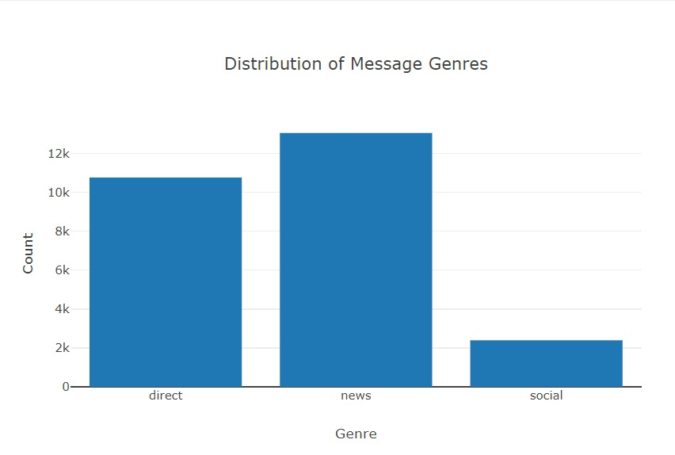
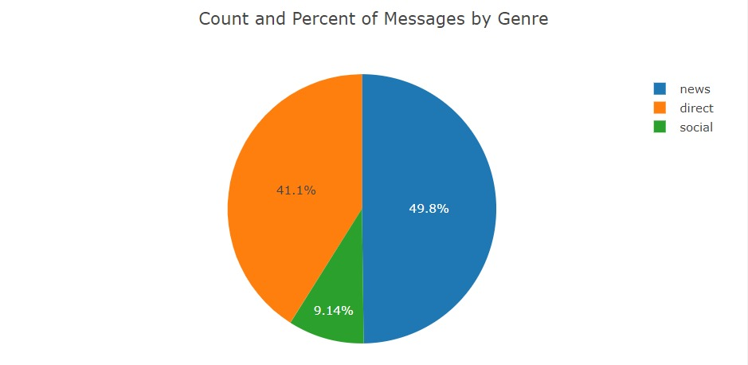

# Disaster Response Pipeline Project
## by (Wael Saleh Alomayrah)

## Dataset

In this project we used a data set containing real messages that were sent during disaster events. We created a machine learning pipeline that categorize these events so that you can send the messages to an appropriate disaster relief agency.
This project include a web app where an emergency worker can input a new message and get classification results in several categories. The web app will also display visualizations of the data.

## Project components

 There are three components you'll need to complete for this project.

### 1. ETL Pipeline
 In a Python script,  process_data.py, write a data cleaning pipeline that:
- Loads the  messages and categories datasets
- Merges the two datasets
- Cleans the data
- Stores it in a SQLite database

### 2. ML Pipeline
In a Python script, train_classifier.py, write a machine learning pipeline that:

- Loads data from the SQLite database
- Splits the dataset into training and test sets
- Builds a text processing and machine learning pipeline
- Trains and tunes a model using GridSearchCV
- Outputs results on the test set
- Exports the final model as a pickle file

### 3. Flask Web App
We used provided  flask web app form Udacity (with some modification).

- we did modify file paths for database and model as needed
- We add Bar and Pie data visualizations using Plotly in the web app.

## Instructions:
1. Run the following commands in the project's root directory to set up your database and model.

    - To run ETL pipeline that cleans data and stores in database
        `python data/process_data.py data/disaster_messages.csv data/disaster_categories.csv data/DisasterResponse.db`
    - To run ML pipeline that trains classifier and saves
        `python models/train_classifier.py data/DisasterResponse.db models/classifier.pkl`

2. Run the following command in the app's directory to run your web app.
    `python run.py`

3. Go to http://0.0.0.0:3001/